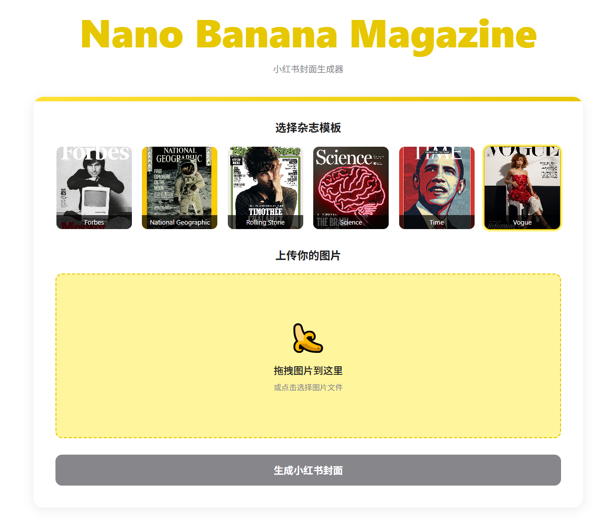

# 🍌 Nano Banana Magazine

一个基于 Nano Banana 的小红书封面生成器，让你轻松创建各种杂志风格的封面图片。仅使用 3 个 Prompt 通过 Qwen3-Coder 生成.



## 在线使用地址

[https://nano-banana-magazine.kcores.com](https://nano-banana-magazine.kcores.com)

## Prompts

### 1

```
请帮我写一个 JavaScript 应用：

名字： Nano Banana Magazine

用途：小红书封面生成器

描述：一个网页应用，内部是一个巨大的卡片，卡片内部是一个虚线框代表上传位置，将图片拖进去后就可以上传，整体使用香蕉黄色配色，参考apple官方风格。
图片上传是上传到gemini image 修图大模型中，你需要参考这个 demo 代码来完成上传和数据接收部分:


import { GoogleGenAI, Modality } from "@google/genai";
import * as fs from "node:fs";

const GEMINI_API_KEY = process.env.GEMINI_API_KEY;

async function main() {

  const ai = new GoogleGenAI({apiKey: GEMINI_API_KEY});

  const imagePath1 = "path/to/cat_image.png";
  const imageData1 = fs.readFileSync(imagePath1);
  const base64Image1 = imageData.toString("base64");
  const imagePath2 = "path/to/mouse_image.png";
  const imageData2 = fs.readFileSync(imagePath2);
  const base64Image2 = imageData.toString("base64");

  const prompt = [
    {
        parts: [
            { text: "Create a picture of my cat eating a mouse in a" +
                    "fancy restaurant under the Gemini constellation" },
            {
              inlineData: {
                mimeType: "image/png",
                data: base64Image1,
              },
            },
            {
              inlineData: {
                mimeType: "image/png",
                data: base64Image2,
              },
            },
        ]
    }
  ];

  const response = await ai.models.generateContent({
    model: "gemini-2.5-flash-image-preview",
    contents: prompt,
  });
  for (const part of response.candidates[0].content.parts) {
    if (part.text) {
      console.log(part.text);
    } else if (part.inlineData) {
      const imageData = part.inlineData.data;
      const buffer = Buffer.from(imageData, "base64");
      fs.writeFileSync("gemini-native-image.png", buffer);
      console.log("Image saved as gemini-native-image.png");
    }
  }
}

main();


最后接收到文本和图片展示到网页上.
```

### 2

```
请帮我修改为右上角有个按钮，点击弹开输入API key并使用。如果没有输入，运行程序的时候需要提示先填写API key
```

### 3

```
在 assets/images/ 文件夹中有6个 杂志封面, 分别是: forbes-cover.jpg, national-geographic-cover.jpg, rolling-stone-cover.jpg, science-cover.jpg, time-cover.jpg, vogue-cover.jpg

用户可以上传自己的图片, 并根据这些杂志封面组成新的图片, 杂志封面对应的 prompt 如下:

Use the magazine cover [image 1] as a template. Replace its original subject and elements with the person and objects from [image 2]. The final image must retain the style, typography, composition, and the subject's pose from the template [image 1].
```
